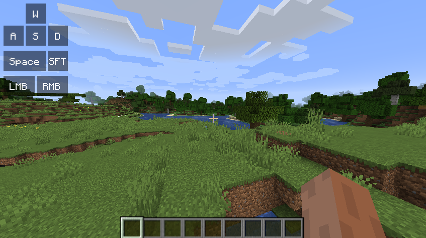
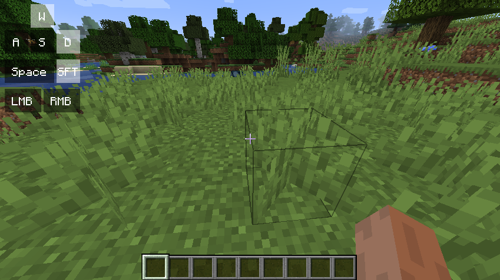

# Keystrokes for Fabric

This mod adds the well-known keystrokes overlay (https://sk1er.club/mods/keystrokesmod), for modern minecraft versions.

## Screenshots

## Features

For now, this mod is in early alpha, so only one default preset is ever present. In the future, more features will be added to this mod, for example:
- Configurable positioning
- More overlays (CPS, FPS, TPS, Latency, etc.)
- Rainbow colors
- ...and more
